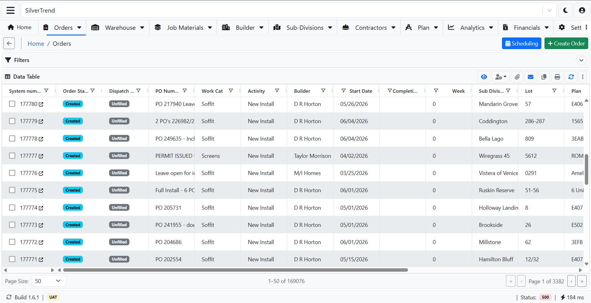

# Unified Operations Suite App

Unified Operations Suite App is a multitenant enterprise web application built with ReactJS and ASP.NET Core REST APIs. The platform was developed to support multiple companies in the construction industry by centralizing operations such as subcontractor management, order processing, dispatching, invoicing, warehouse control, reporting, and administrative workflows.

The application is designed to allow different companies to operate independently while sharing a centralized system architecture, reusable modules, standardized workflows, and secure role-based access control.

## Technical Overview

The frontend was developed with ReactJS, JavaScript/JSX, Bootstrap 5, AG Grid, React Query, modular components, reusable custom hooks, responsive layouts, dynamic filters, offcanvas panels, modals, and enterprise-style dashboards.

The backend was built using ASP.NET Core Web API, C#, Entity Framework Core, MySQL, dependency injection, service and repository layers, DTOs, structured API responses, authentication services, server-side pagination, filtering, sorting, validation, and role-based permission management.

## Main Features
Multitenant company support
Order creation and order management
Subcontractor assignment and tracking
Dispatch management
Invoice management and printing
Warehouse and material control
Builder, subdivision, plan, and material modules
User management and role-based permissions
Advanced AG Grid tables with filtering, sorting, pagination, export, and column state persistence
REST API integration across multiple backend services
Azure-based deployment and CI/CD pipeline support

## Tech Stack
Frontend: ReactJS, JavaScript, Bootstrap 5, AG Grid, React Query, React Hooks
Backend: ASP.NET Core, C#, REST APIs, Entity Framework Core
Database: MySQL
Cloud & DevOps: Microsoft Azure, Azure App Services, Azure DevOps, CI/CD Pipelines
Architecture: Multitenant design, service/repository pattern, DTO-based API communication, modular frontend architecture, role-based access control

## Architecture Overview

## Application Screenshots

### Main Dashboard

### Order Management Module

### Invoice Management

### Warehouse Control

